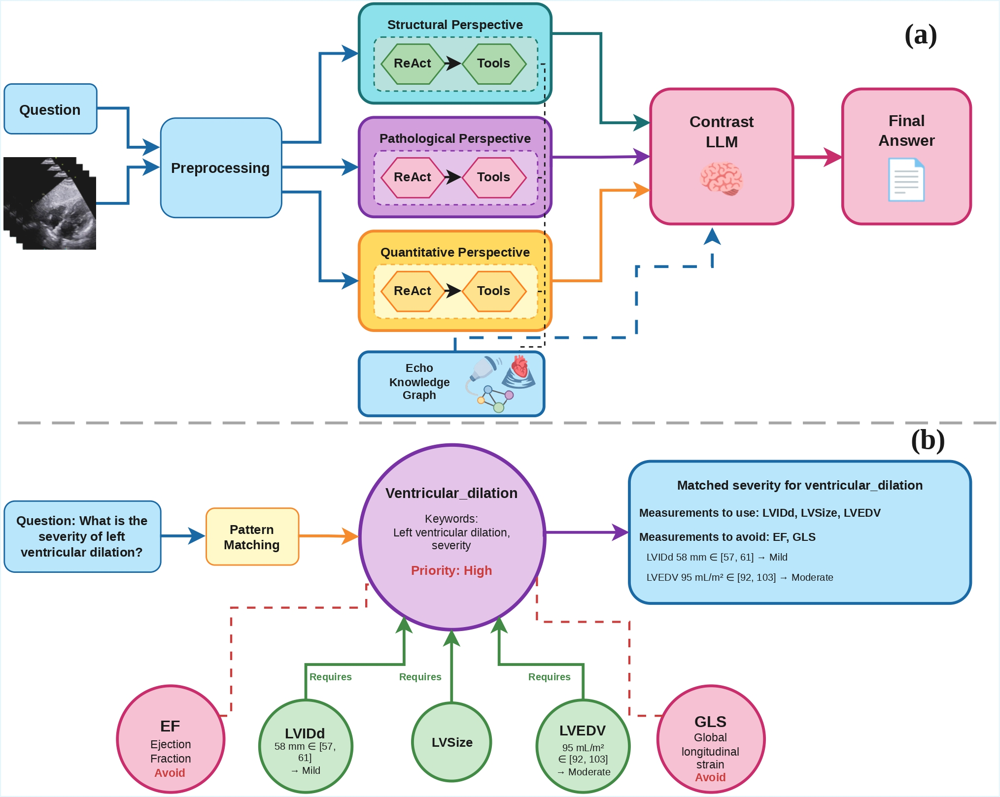

<div align="center">

# Echo-CoPilot 🫀
### A Multiple-Perspective Agentic Framework for Reliable Echocardiography Interpretation

<p>
  <a href="https://arxiv.org/abs/2512.09944"></a>
  <a href="https://conferences.miccai.org/2026/"></a>
  <a href="LICENSE"></a>
  
  <a href="https://github.com/moeinheidari7829/Echo-CoPilot/stargazers"></a>
</p>

**Moein Heidari**<sup>1</sup> · Ali Mehrabian<sup>1</sup> · Mohammad Amin Roohi<sup>1</sup> · Wenjin Chen<sup>2</sup> · David J. Foran<sup>2</sup> · Jasmine Grewal<sup>1</sup> · Ilker Hacihaliloglu<sup>1</sup>

<sup>1</sup> The University of British Columbia &nbsp;·&nbsp; <sup>2</sup> Rutgers Cancer Institute

<a href="https://arxiv.org/abs/2512.09944">📄 Paper</a> &nbsp;|&nbsp; <a href="#-quick-start">⚡ Quick Start</a> &nbsp;|&nbsp; <a href="#-citation">📝 Citation</a>

</div>

---

> 📢 **News**
> - **[2026-06]** Echo-CoPilot is accepted to **MICCAI 2026** (Strasbourg, France)! 🎉
> - **[2026-06]** Code and evaluation framework are publicly released.

<div align="center">
  
  <br>
  <em>Overview of Echo-CoPilot. Three perspective ReAct agents reason over the exam and are reconciled by a self-contrast module, with EchoKG providing guideline-grounded measurement selection and thresholds.</em>
</div>

---

## 🩺 TL;DR

Echocardiography interpretation requires fusing multi-view video, quantitative measurements, and guideline-grounded reasoning — yet foundation-model pipelines act as black boxes and become unreliable near clinical cutoffs. **Echo-CoPilot** is an end-to-end **agentic** framework that runs three complementary reasoning perspectives, grounds them in a clinical **knowledge graph (EchoKG)**, and reconciles them with a **self-contrast** mechanism to deliver accurate *and* auditable interpretation.

## ✨ Highlights

- 🧭 **Multi-perspective reasoning** — three independent ReAct agents (structural, pathological, quantitative) analyze the same study and cross-validate each other.
- 📚 **EchoKG knowledge graph** — encodes ASE/EACVI guidelines as `requires`/`avoid` edges and clinical thresholds, so the agent selects the *right* measurements for each question.
- 🔍 **Self-contrast mechanism** — a contrast LLM builds a discrepancy checklist and resolves borderline conflicts instead of naive majority voting.
- 📈 **State of the art on MIMICEchoQA** — with higher stability and fewer answer flips across repeated runs.
- 🧩 **Modular tools** — EchoPrime, PanEcho, and MedSAM2 are wrapped as callable modules with a shared deterministic cache.

## 🛠️ Installation

```bash
git clone https://github.com/moeinheidari7829/Echo-CoPilot.git
cd Echo-CoPilot

# with uv (recommended)
uv sync
# or with pip
pip install -r requirements.txt

# configure API access
cp .env.example .env
# then edit .env (see Configuration below)

# download tool model weights
python download_models.py
```

## 📁 Dataset

Echo-CoPilot is evaluated on **MIMICEchoQA**, which requires PhysioNet credentials and is **not** redistributed here. After obtaining access, place it at:

```
mimic-iv-echo-ext-mimicechoqa-.../
```

## ⚡ Quick Start

```bash
# run on a few examples
uv run python experiment/test_llm_with_tools.py --num-examples 10

# full benchmark across all four configurations
./experiment/run_full_accuracy_comparison.sh 622
```

Prefer an interactive demo? Launch the app:

```bash
streamlit run streamlit_app.py
```

## ⚙️ Configuration

Set in `.env`:

| Variable | Description |
| :--- | :--- |
| `OPENAI_API_KEY` | API key for the reasoning LLM |
| `OPENAI_MODEL` | LLM used by the agents (paper results use `gpt-oss-120b`) |
| `MEASUREMENT_TOOL` | `echoprime` / `echonet` / `both` |
| `USE_SELF_CONTRAST` | Enable the 3-perspective self-contrast mechanism |

## 🗂️ Project Structure

```
Echo-CoPilot/
├── agents/          # ReAct perspective agents (structural, pathological, quantitative)
├── tools/           # Echo tool wrappers (EchoPrime, PanEcho, MedSAM2, EchoKG, RAG)
├── models/          # Model loading utilities
├── configs/         # Configuration files
├── experiment/      # Evaluation scripts
├── rag_index/       # FAISS guideline indices
├── utils/           # Helpers
├── assets/          # Figures
├── streamlit_app.py # Interactive demo
├── main.py          # Entry point
└── download_models.py
```

## 📝 Citation

If you find this work useful, please consider citing:

```bibtex
@inproceedings{heidari2026echocopilot,
  title     = {Echo-CoPilot: A Multiple-Perspective Agentic Framework for Reliable Echocardiography Interpretation},
  author    = {Heidari, Moein and Mehrabian, Ali and Roohi, Mohammad Amin and Chen, Wenjin and Foran, David J. and Grewal, Jasmine and Hacihaliloglu, Ilker},
  booktitle = {Medical Image Computing and Computer Assisted Intervention (MICCAI)},
  year      = {2026}
}
```

## 🙏 Acknowledgements

We thank the authors of [EchoPrime](https://github.com/echonet), [PanEcho](https://github.com/CarDS-Yale/PanEcho), and [MedSAM2](https://github.com/bowang-lab/MedSAM2) for their open-source tools, and the creators of the MIMICEchoQA benchmark. This work was supported by CFI-JELF, Mitacs, and NSERC.

## 📄 License

Released under the MIT License. See [LICENSE](LICENSE) for details.
